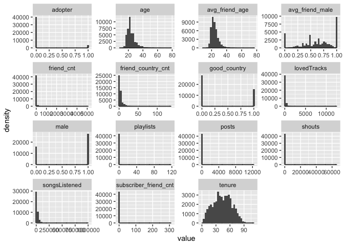
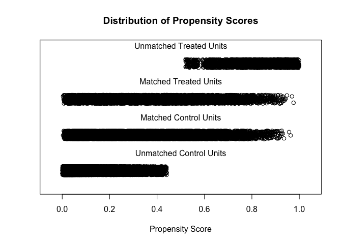

High Note Free to Fee Strategy Analysis
================
Joy
2/24/2021

``` r
#install.packages("MatchIt")
#install.packages("pastecs")
#install.packages("gridExtra")
#install.packages("flextable")
#install.packages("systemfonts")
library(flextable)
library(pastecs)
library(MatchIt)
library(tidyverse)
```

    ## ── Attaching packages ─────────────────────────────────────── tidyverse 1.3.0 ──

    ## ✓ ggplot2 3.3.3     ✓ purrr   0.3.4
    ## ✓ tibble  3.1.0     ✓ dplyr   1.0.5
    ## ✓ tidyr   1.1.3     ✓ stringr 1.4.0
    ## ✓ readr   1.4.0     ✓ forcats 0.5.1

    ## ── Conflicts ────────────────────────────────────────── tidyverse_conflicts() ──
    ## x purrr::compose() masks flextable::compose()
    ## x tidyr::extract() masks pastecs::extract()
    ## x dplyr::filter()  masks stats::filter()
    ## x dplyr::first()   masks pastecs::first()
    ## x dplyr::lag()     masks stats::lag()
    ## x dplyr::last()    masks pastecs::last()

``` r
library(gridExtra)
```

    ## 
    ## Attaching package: 'gridExtra'

    ## The following object is masked from 'package:dplyr':
    ## 
    ##     combine

``` r
setwd("/Users/joychen/OneDrive - UC Irvine/277Customer/HighNote_Analysis")
data <- read.csv("HighNote Data.csv") %>% select(-ID) 
head(data,4)
```

    ##   age male friend_cnt avg_friend_age avg_friend_male friend_country_cnt
    ## 1  22    0          8       22.57143       0.4285714                  1
    ## 2  35    0          2       28.00000       1.0000000                  2
    ## 3  27    1          2       23.00000       1.0000000                  1
    ## 4  21    0         28       22.94737       0.5000000                  7
    ##   subscriber_friend_cnt songsListened lovedTracks posts playlists shouts
    ## 1                     0          9687         194     0         1      8
    ## 2                     0             0           0     0         0      0
    ## 3                     0           508           0     0         1      2
    ## 4                     1          1357          32     0         0      1
    ##   adopter tenure good_country
    ## 1       0     59            1
    ## 2       0     35            0
    ## 3       0     42            0
    ## 4       0     25            0

# 1. Summary statistics

Generate descriptive statistics for the key variables in the data set.

``` r
options(scipen=999) #avoid scientific notations in the chart
options(digits=2)

stats_adopter <- t(stat.desc(data[data$adopter == 1,])[4:13,][-c(4,7,8, 9),])
stats_adopter <- cbind(adopter = 1, n = nrow(data[data$adopter == 1,]),stats_adopter)
stats_non_adopter <- t(stat.desc(data[data$adopter == 0,])[4:13,][-c(4,7,8, 9),])
stats_non_adopter <- cbind(adopter = 0, n = nrow(data[data$adopter == 0,]),stats_non_adopter)
stats <- rbind(stats_non_adopter,stats_adopter)
stats <- subset(tibble::rownames_to_column(as.data.frame(stats), "item"),
       select = c(2,3,1,8,9,4,5,6,7))
stats <- flextable(stats) %>% merge_v(j = c("adopter","n")) %>%
  hline(i=15)
stats
```

    ## PhantomJS not found. You can install it with webshot::install_phantomjs(). If it is installed, please make sure the phantomjs executable can be found via the PATH variable.

### Comparison

Analyze the mean for each variable by the outcome status (subscriber or
not).

``` r
compare <- data %>%
  group_by(adopter) %>%
  summarise_all(funs(mean(., na.rm = T)))
```

    ## Warning: `funs()` was deprecated in dplyr 0.8.0.
    ## Please use a list of either functions or lambdas: 
    ## 
    ##   # Simple named list: 
    ##   list(mean = mean, median = median)
    ## 
    ##   # Auto named with `tibble::lst()`: 
    ##   tibble::lst(mean, median)
    ## 
    ##   # Using lambdas
    ##   list(~ mean(., trim = .2), ~ median(., na.rm = TRUE))

``` r
compare
```

    ## # A tibble: 2 x 15
    ##   adopter   age  male friend_cnt avg_friend_age avg_friend_male friend_country_…
    ##     <int> <dbl> <dbl>      <dbl>          <dbl>           <dbl>            <dbl>
    ## 1       0  23.9 0.622       18.5           24.0           0.617             3.96
    ## 2       1  26.0 0.729       39.7           25.4           0.637             7.19
    ## # … with 8 more variables: subscriber_friend_cnt <dbl>, songsListened <dbl>,
    ## #   lovedTracks <dbl>, posts <dbl>, playlists <dbl>, shouts <dbl>,
    ## #   tenure <dbl>, good_country <dbl>

Before diving into any further analysis, we see that subscribers have
more than double the number of friends, double the amount of music they
listen to, double the playlists, triple the amount of music liked and
shouts, and four time the posts. There’s a high correlation between
being a subscriber and the amount of engagement they do on the platform.
Either they’re a hardcore user that drove them to subscribe, or that
paying the service drive them to use the platform more.

### Visualization

A quick view of the distribution of all the variables. These
distribution chart is used to determine which variables we will need to
take log values.  
Non-binary variables with skewed distribution will be logged later.

``` r
data_distribution <- data %>%
  as_data_frame() %>%
  select_if(is.numeric) %>%
  gather(key = "variable", value = "value")
```

    ## Warning: `as_data_frame()` was deprecated in tibble 2.0.0.
    ## Please use `as_tibble()` instead.
    ## The signature and semantics have changed, see `?as_tibble`.

``` r
ggplot(data_distribution, aes(value)) +
  geom_density() +
  facet_wrap(~variable,scales = "free") +
  geom_histogram()
```

    ## `stat_bin()` using `bins = 30`. Pick better value with `binwidth`.

<!-- -->

# 2. Propensity Score Matching (PSM)

We would like to learn whether having subscriber friends affects the
likelihood of becoming an adopter.

### Pre-analysis using non-matched data

We first look the mean of number of friends that are subscribers in the
two groups (adopter or not).

``` r
# distribution of the outcome
data %>%
  group_by(adopter) %>%
  summarise(num_of_people = n(),
            avg_subscriber_friends = mean(subscriber_friend_cnt))
```

    ## # A tibble: 2 x 3
    ##   adopter num_of_people avg_subscriber_friends
    ##     <int>         <int>                  <dbl>
    ## 1       0         40300                  0.417
    ## 2       1          3527                  1.64

We create a new variable called “friends\_treatment” and add dummy
variable 1 for users who have friends who are subscribers

``` r
data$friends_treatment <- ifelse(data$subscriber_friend_cnt >= 1, 1,0)

# t-test difference-in-means: outcome with non-matching friends_treatment
options(scipen=0)
with(data, t.test(adopter ~ friends_treatment))
```

    ## 
    ##  Welch Two Sample t-test
    ## 
    ## data:  adopter by friends_treatment
    ## t = -31, df = 11815, p-value <2e-16
    ## alternative hypothesis: true difference in means is not equal to 0
    ## 95 percent confidence interval:
    ##  -0.13 -0.12
    ## sample estimates:
    ## mean in group 0 mean in group 1 
    ##           0.052           0.178

The difference of the means between the two groups is significant. it
seems that there’s a strong correlation between having subscriber
friends and subscribing. We will use PSM to further make sure this
conclusion is accurate by eliminating other potential factors.

``` r
# the covariates we will analyze
cov <-c("age","male","friend_cnt","avg_friend_age", "avg_friend_male",
        "friend_country_cnt", "songsListened", 
        "lovedTracks", "posts", "playlists", "shouts", "tenure", "good_country")

# calculate the mean for each covariate by the treatment status
compare_treatment <- data %>%
  group_by(friends_treatment) %>%
  summarise_all(funs(mean(., na.rm = T)))
compare_treatment
```

    ## # A tibble: 2 x 16
    ##   friends_treatment   age  male friend_cnt avg_friend_age avg_friend_male
    ##               <dbl> <dbl> <dbl>      <dbl>          <dbl>           <dbl>
    ## 1                 0  23.7 0.629       10.4           23.8           0.613
    ## 2                 1  25.4 0.636       54.0           25.4           0.636
    ## # … with 10 more variables: friend_country_cnt <dbl>,
    ## #   subscriber_friend_cnt <dbl>, songsListened <dbl>, lovedTracks <dbl>,
    ## #   posts <dbl>, playlists <dbl>, shouts <dbl>, adopter <dbl>, tenure <dbl>,
    ## #   good_country <dbl>

``` r
output0 = NULL
for (i in 1:length(cov)){
  name = cov[i]
  p_value = t.test(data[, name] ~ data$friends_treatment)$p.value
  output0 <- rbind(output0, data.frame(name, p_value))
}
print(output0) # t-test diff in means for pre match data
```

    ##                  name  p_value
    ## 1                 age  4.4e-95
    ## 2                male  1.8e-01
    ## 3          friend_cnt 7.0e-236
    ## 4      avg_friend_age 1.9e-164
    ## 5     avg_friend_male  1.3e-14
    ## 6  friend_country_cnt  0.0e+00
    ## 7       songsListened  0.0e+00
    ## 8         lovedTracks 2.5e-205
    ## 9               posts  1.9e-13
    ## 10          playlists  1.2e-25
    ## 11             shouts  4.8e-30
    ## 12             tenure  1.4e-48
    ## 13       good_country  3.6e-02

### Propensity score estimation

Variables we will take logs: age, friend\_cnt, avg\_friend\_age,
friend\_country\_cnt, subscriber\_friend\_cnt, songsListened,
lovedTracks, playlists, shouts, posts. We do not need to take logs for
binary variables and avg\_friend\_male, tenure (both normally
distributed).

``` r
options(scipen=0)
friends_ps <- glm(friends_treatment ~ log(age) + male +log(friend_cnt+1) + 
                    log(avg_friend_age+1)  + avg_friend_male+ + 
                    log(friend_country_cnt+1) + log(songsListened+1) + 
                    log(lovedTracks+1) + log(posts+1) + log(playlists+1) + 
                    log(shouts+1) + tenure + good_country, 
                  family = binomial(), data = data)
summary(friends_ps)
```

    ## 
    ## Call:
    ## glm(formula = friends_treatment ~ log(age) + male + log(friend_cnt + 
    ##     1) + log(avg_friend_age + 1) + avg_friend_male + +log(friend_country_cnt + 
    ##     1) + log(songsListened + 1) + log(lovedTracks + 1) + log(posts + 
    ##     1) + log(playlists + 1) + log(shouts + 1) + tenure + good_country, 
    ##     family = binomial(), data = data)
    ## 
    ## Deviance Residuals: 
    ##    Min      1Q  Median      3Q     Max  
    ## -2.573  -0.568  -0.300  -0.118   3.377  
    ## 
    ## Coefficients:
    ##                              Estimate Std. Error z value Pr(>|z|)    
    ## (Intercept)                 -1.86e+01   3.16e-01  -58.99  < 2e-16 ***
    ## log(age)                     6.41e-01   9.54e-02    6.71  1.9e-11 ***
    ## male                         7.95e-02   3.14e-02    2.53   0.0113 *  
    ## log(friend_cnt + 1)          1.09e+00   2.72e-02   40.02  < 2e-16 ***
    ## log(avg_friend_age + 1)      3.48e+00   1.25e-01   27.75  < 2e-16 ***
    ## avg_friend_male              2.49e-01   5.95e-02    4.18  2.9e-05 ***
    ## log(friend_country_cnt + 1)  5.54e-01   3.20e-02   17.31  < 2e-16 ***
    ## log(songsListened + 1)       5.23e-02   9.19e-03    5.69  1.2e-08 ***
    ## log(lovedTracks + 1)         8.32e-02   7.99e-03   10.41  < 2e-16 ***
    ## log(posts + 1)               8.70e-02   1.49e-02    5.83  5.4e-09 ***
    ## log(playlists + 1)          -1.62e-01   3.55e-02   -4.57  4.8e-06 ***
    ## log(shouts + 1)             -3.54e-02   1.37e-02   -2.59   0.0095 ** 
    ## tenure                      -9.60e-03   8.81e-04  -10.89  < 2e-16 ***
    ## good_country                 6.50e-02   3.04e-02    2.14   0.0324 *  
    ## ---
    ## Signif. codes:  0 '***' 0.001 '**' 0.01 '*' 0.05 '.' 0.1 ' ' 1
    ## 
    ## (Dispersion parameter for binomial family taken to be 1)
    ## 
    ##     Null deviance: 46640  on 43826  degrees of freedom
    ## Residual deviance: 31483  on 43813  degrees of freedom
    ## AIC: 31511
    ## 
    ## Number of Fisher Scoring iterations: 6

``` r
# predicted propensity score
prs_df <- data.frame(pr_score = predict(friends_ps, type = "response"),
                     treatment = friends_ps$model$friends_treatment)
head(prs_df,3)
```

    ##   pr_score treatment
    ## 1    0.073         0
    ## 2    0.052         0
    ## 3    0.023         0

### Examine the region of common support

``` r
# plot histogram of treatment status
labs <- paste("Treatment type:", 
              c("Treatment w/ subscriber friends", "Control w/o subscriber friends"))
prs_df %>%
  mutate(treatment_lab = ifelse(treatment == 1, labs[1], labs[2])) %>%
  ggplot(aes(x = pr_score)) +
  geom_histogram(color = "white") +
  facet_wrap(~treatment_lab) +
  xlab("Probability of having subscriber friends") +
  theme_bw()
```

    ## `stat_bin()` using `bins = 30`. Pick better value with `binwidth`.

<!-- -->
### Executing a matching algorithm

``` r
# MatchIt does not allow missing values
sum(is.na(data))  # no missing data in our data
```

    ## [1] 0

``` r
mod_match <- matchit(friends_treatment ~ log(age) + male +log(friend_cnt+1) + 
                       log(avg_friend_age+1)  + avg_friend_male+ + 
                       log(friend_country_cnt+1) + log(songsListened+1) + 
                       log(lovedTracks+1) + log(posts+1) + log(playlists+1) + 
                       log(shouts+1) + tenure + good_country, 
                     method = "nearest", data = data, caliper = .05)

# the "distance" in the final data set is the propensity score
plot(mod_match,type = "jitter")
```

<!-- -->

    ## [1] "To identify the units, use first mouse button; to stop, use second."

    ## integer(0)

``` r
summary(mod_match)
```

    ## 
    ## Call:
    ## matchit(formula = friends_treatment ~ log(age) + male + log(friend_cnt + 
    ##     1) + log(avg_friend_age + 1) + avg_friend_male + +log(friend_country_cnt + 
    ##     1) + log(songsListened + 1) + log(lovedTracks + 1) + log(posts + 
    ##     1) + log(playlists + 1) + log(shouts + 1) + tenure + good_country, 
    ##     data = data, method = "nearest", caliper = 0.05)
    ## 
    ## Summary of Balance for All Data:
    ##                             Means Treated Means Control Std. Mean Diff.
    ## distance                             0.50          0.14           1.256
    ## log(age)                             3.20          3.14           0.253
    ## male                                 0.64          0.63           0.015
    ## log(friend_cnt + 1)                  3.33          1.94           1.250
    ## log(avg_friend_age + 1)              3.26          3.19           0.364
    ## avg_friend_male                      0.64          0.61           0.099
    ## log(friend_country_cnt + 1)          2.00          1.12           1.081
    ## log(songsListened + 1)               9.60          7.94           0.945
    ## log(lovedTracks + 1)                 3.96          2.45           0.738
    ## log(posts + 1)                       0.84          0.29           0.406
    ## log(playlists + 1)                   0.41          0.34           0.166
    ## log(shouts + 1)                      3.04          1.72           0.782
    ## tenure                              46.55         43.20           0.168
    ## good_country                         0.34          0.35          -0.024
    ##                             Var. Ratio eCDF Mean eCDF Max
    ## distance                          2.79     0.364    0.561
    ## log(age)                          1.14     0.024    0.116
    ## male                                 .     0.007    0.007
    ## log(friend_cnt + 1)               1.38     0.085    0.499
    ## log(avg_friend_age + 1)           0.94     0.107    0.180
    ## avg_friend_male                   0.47     0.085    0.192
    ## log(friend_country_cnt + 1)       2.13     0.080    0.484
    ## log(songsListened + 1)            0.42     0.227    0.316
    ## log(lovedTracks + 1)              1.07     0.089    0.315
    ## log(posts + 1)                    3.18     0.021    0.227
    ## log(playlists + 1)                1.37     0.006    0.063
    ## log(shouts + 1)                   1.86     0.068    0.366
    ## tenure                            1.02     0.031    0.065
    ## good_country                         .     0.011    0.011
    ## 
    ## 
    ## Summary of Balance for Matched Data:
    ##                             Means Treated Means Control Std. Mean Diff.
    ## distance                             0.37          0.36           0.014
    ## log(age)                             3.19          3.19          -0.004
    ## male                                 0.64          0.64           0.011
    ## log(friend_cnt + 1)                  2.90          2.88           0.013
    ## log(avg_friend_age + 1)              3.25          3.25           0.001
    ## avg_friend_male                      0.63          0.63          -0.004
    ## log(friend_country_cnt + 1)          1.68          1.68           0.003
    ## log(songsListened + 1)               9.35          9.32           0.017
    ## log(lovedTracks + 1)                 3.56          3.54           0.009
    ## log(posts + 1)                       0.62          0.61           0.011
    ## log(playlists + 1)                   0.39          0.38           0.005
    ## log(shouts + 1)                      2.56          2.57          -0.006
    ## tenure                              46.08         45.84           0.012
    ## good_country                         0.35          0.35          -0.009
    ##                             Var. Ratio eCDF Mean eCDF Max Std. Pair Dist.
    ## distance                          1.04     0.002    0.019           0.014
    ## log(age)                          0.87     0.008    0.035           1.064
    ## male                                 .     0.005    0.005           0.957
    ## log(friend_cnt + 1)               0.92     0.002    0.021           0.560
    ## log(avg_friend_age + 1)           0.74     0.027    0.053           1.137
    ## avg_friend_male                   0.96     0.006    0.017           1.164
    ## log(friend_country_cnt + 1)       0.91     0.003    0.018           0.595
    ## log(songsListened + 1)            0.99     0.005    0.012           0.954
    ## log(lovedTracks + 1)              1.06     0.006    0.022           0.996
    ## log(posts + 1)                    1.08     0.002    0.007           0.672
    ## log(playlists + 1)                1.08     0.001    0.012           0.902
    ## log(shouts + 1)                   1.01     0.002    0.015           0.860
    ## tenure                            1.09     0.009    0.022           1.120
    ## good_country                         .     0.004    0.004           0.971
    ## 
    ## Percent Balance Improvement:
    ##                             Std. Mean Diff. Var. Ratio eCDF Mean eCDF Max
    ## distance                                 99       95.9       100       97
    ## log(age)                                 98       -3.8        68       70
    ## male                                     28          .        28       28
    ## log(friend_cnt + 1)                      99       73.7        98       96
    ## log(avg_friend_age + 1)                 100     -353.6        74       71
    ## avg_friend_male                          96       94.6        93       91
    ## log(friend_country_cnt + 1)             100       87.9        97       96
    ## log(songsListened + 1)                   98       99.1        98       96
    ## log(lovedTracks + 1)                     99       15.2        93       93
    ## log(posts + 1)                           97       93.7        90       97
    ## log(playlists + 1)                       97       75.7        78       81
    ## log(shouts + 1)                          99       98.8        96       96
    ## tenure                                   93     -351.1        71       67
    ## good_country                             64          .        64       64
    ## 
    ## Sample Sizes:
    ##           Control Treated
    ## All         34004    9823
    ## Matched      6975    6975
    ## Unmatched   27029    2848
    ## Discarded       0       0

``` r
# create a dataframe containing only the matched data
dta_m <- match.data(mod_match)
dim(dta_m) 
```

    ## [1] 13950    19

### Difference in means

The means below indicate that we have attained a high degree of balance
on the 13 covariates included in the model.

``` r
treatment_compare <- dta_m %>%
  group_by(friends_treatment) %>%
  select(one_of(cov)) %>%
  summarise_all(funs(mean))
```

    ## Adding missing grouping variables: `friends_treatment`

``` r
treatment_compare
```

    ## # A tibble: 2 x 14
    ##   friends_treatment   age  male friend_cnt avg_friend_age avg_friend_male
    ##               <dbl> <dbl> <dbl>      <dbl>          <dbl>           <dbl>
    ## 1                 0  25.0 0.637       25.5           25.3           0.633
    ## 2                 1  24.9 0.642       25.2           25.2           0.632
    ## # … with 8 more variables: friend_country_cnt <dbl>, songsListened <dbl>,
    ## #   lovedTracks <dbl>, posts <dbl>, playlists <dbl>, shouts <dbl>,
    ## #   tenure <dbl>, good_country <dbl>

``` r
# t-test other variables with the treatment variable
output = NULL
for (i in 1:length(cov)){
  name = cov[i]
  p_value = t.test(dta_m[, name] ~ dta_m$friends_treatment)$p.value
  output <- rbind(output, data.frame(name, p_value))
}
print(output) 
```

    ##                  name p_value
    ## 1                 age   0.199
    ## 2                male   0.514
    ## 3          friend_cnt   0.493
    ## 4      avg_friend_age   0.092
    ## 5     avg_friend_male   0.840
    ## 6  friend_country_cnt   0.141
    ## 7       songsListened   0.114
    ## 8         lovedTracks   0.033
    ## 9               posts   0.508
    ## 10          playlists   0.536
    ## 11             shouts   0.390
    ## 12             tenure   0.462
    ## 13       good_country   0.606

We are not able to reject the null hypothesis of no mean difference for
all covariate besides “lovedTracks”. “loveTracks” is statistically
significant (&lt;.05) that there’s a difference in the means between
treatment and control group.

### Visual inspection

``` r
fn_bal <- function(dta_m, variable) {
  dta_m$variable <- dta_m[, variable]
  dta_m$friends_treatment <- as.factor(dta_m$friends_treatment)
  support <- c(min(dta_m$variable), max(dta_m$variable))
  ggplot(dta_m, aes(x = distance, y = variable, color = friends_treatment)) +
    geom_point(alpha = 0.2, size = 1.3) +
    geom_smooth(method = "loess", se = F) +
    xlab("Propensity score") +
    ylab(variable) +
    theme_bw() +
    ylim(support)
}
    
grid.arrange(
  fn_bal(dta_m, "age"),
  fn_bal(dta_m, "friend_cnt") + theme(legend.position = "none"),
  fn_bal(dta_m, "avg_friend_age"),
  fn_bal(dta_m, "avg_friend_male") + theme(legend.position = "none"),
  fn_bal(dta_m, "friend_country_cnt"),
  fn_bal(dta_m, "songsListened") + theme(legend.position = "none"),
  fn_bal(dta_m, "lovedTracks"),
  fn_bal(dta_m, "posts") + theme(legend.position = "none"),
  fn_bal(dta_m, "playlists"),
  fn_bal(dta_m, "shouts") + theme(legend.position = "none"),
  fn_bal(dta_m, "tenure"),
  fn_bal(dta_m, "good_country") + theme(legend.position = "none"),
  nrow = 6, widths = c(16, 8)
)
```

<!-- -->
### Estimating treatment effects

``` r
# method1: t-test
with(dta_m, t.test(adopter ~ friends_treatment))
```

    ## 
    ##  Welch Two Sample t-test
    ## 
    ## data:  adopter by friends_treatment
    ## t = -10, df = 13407, p-value <2e-16
    ## alternative hypothesis: true difference in means is not equal to 0
    ## 95 percent confidence interval:
    ##  -0.068 -0.046
    ## sample estimates:
    ## mean in group 0 mean in group 1 
    ##           0.094           0.151

``` r
# method2: OLS
lm_treat <- glm(adopter ~ friends_treatment, data = dta_m)
summary(lm_treat)
```

    ## 
    ## Call:
    ## glm(formula = adopter ~ friends_treatment, data = dta_m)
    ## 
    ## Deviance Residuals: 
    ##     Min       1Q   Median       3Q      Max  
    ## -0.1513  -0.1513  -0.0943  -0.0943   0.9057  
    ## 
    ## Coefficients:
    ##                   Estimate Std. Error t value Pr(>|t|)    
    ## (Intercept)        0.09434    0.00392    24.1   <2e-16 ***
    ## friends_treatment  0.05692    0.00554    10.3   <2e-16 ***
    ## ---
    ## Signif. codes:  0 '***' 0.001 '**' 0.01 '*' 0.05 '.' 0.1 ' ' 1
    ## 
    ## (Dispersion parameter for gaussian family taken to be 0.11)
    ## 
    ##     Null deviance: 1502.7  on 13949  degrees of freedom
    ## Residual deviance: 1491.4  on 13948  degrees of freedom
    ## AIC: 8405
    ## 
    ## Number of Fisher Scoring iterations: 2

Conclusion: Yes, having (a) subscriber friend(s) has a positive effect
moving a user from free to fee tier. Looking at the coefficient of the
equation, when a user has one or more subscriber friends, it increases
the odds ratio of subscribing by 10%.

``` r
exp(0.05692)
```

    ## [1] 1.1

# 3. Regression Analyses

Use a logistic regression approach to test which variables (including
subscriber friends) are significant for explaining the likelihood of
becoming an adopter.

We will use the matched data and the logged variables from question
3,adding logged “subscriber\_friend\_cnt”, to run a logistic model.

``` r
model <- glm(adopter ~ log(age) + male +log(friend_cnt+1) + 
               log(avg_friend_age+1)  + avg_friend_male+ + 
               log(friend_country_cnt+1) + log(subscriber_friend_cnt+1) + 
               log(songsListened+1) + log(lovedTracks+1) + log(posts+1) + 
               log(playlists+1) + log(shouts+1) + tenure + good_country, 
             family = binomial(), data = dta_m)
summary(model)
```

    ## 
    ## Call:
    ## glm(formula = adopter ~ log(age) + male + log(friend_cnt + 1) + 
    ##     log(avg_friend_age + 1) + avg_friend_male + +log(friend_country_cnt + 
    ##     1) + log(subscriber_friend_cnt + 1) + log(songsListened + 
    ##     1) + log(lovedTracks + 1) + log(posts + 1) + log(playlists + 
    ##     1) + log(shouts + 1) + tenure + good_country, family = binomial(), 
    ##     data = dta_m)
    ## 
    ## Deviance Residuals: 
    ##    Min      1Q  Median      3Q     Max  
    ## -1.661  -0.551  -0.414  -0.285   3.027  
    ## 
    ## Coefficients:
    ##                                Estimate Std. Error z value Pr(>|z|)    
    ## (Intercept)                    -8.66438    0.66457  -13.04  < 2e-16 ***
    ## log(age)                        0.58008    0.17968    3.23   0.0012 ** 
    ## male                            0.30182    0.06189    4.88  1.1e-06 ***
    ## log(friend_cnt + 1)            -0.01921    0.05285   -0.36   0.7162    
    ## log(avg_friend_age + 1)         0.59488    0.24385    2.44   0.0147 *  
    ## avg_friend_male                 0.04608    0.12012    0.38   0.7013    
    ## log(friend_country_cnt + 1)    -0.04290    0.05953   -0.72   0.4711    
    ## log(subscriber_friend_cnt + 1)  0.76517    0.05430   14.09  < 2e-16 ***
    ## log(songsListened + 1)          0.22214    0.02376    9.35  < 2e-16 ***
    ## log(lovedTracks + 1)            0.25409    0.01656   15.34  < 2e-16 ***
    ## log(posts + 1)                  0.11069    0.02523    4.39  1.2e-05 ***
    ## log(playlists + 1)              0.18246    0.06215    2.94   0.0033 ** 
    ## log(shouts + 1)                -0.10633    0.02427   -4.38  1.2e-05 ***
    ## tenure                         -0.00927    0.00169   -5.48  4.2e-08 ***
    ## good_country                   -0.49561    0.06037   -8.21  < 2e-16 ***
    ## ---
    ## Signif. codes:  0 '***' 0.001 '**' 0.01 '*' 0.05 '.' 0.1 ' ' 1
    ## 
    ## (Dispersion parameter for binomial family taken to be 1)
    ## 
    ##     Null deviance: 10391.6  on 13949  degrees of freedom
    ## Residual deviance:  9458.9  on 13935  degrees of freedom
    ## AIC: 9489
    ## 
    ## Number of Fisher Scoring iterations: 5

``` r
# remove variables that are not statistically significant
model2 <- glm(adopter ~ log(age) + male + 
               log(avg_friend_age+1) + 
               log(subscriber_friend_cnt+1) + 
               log(songsListened+1) + log(lovedTracks+1) + log(posts+1) + 
               log(playlists+1) + log(shouts+1) + tenure + good_country, 
             family = binomial(), data = dta_m)
summary(model2)
```

    ## 
    ## Call:
    ## glm(formula = adopter ~ log(age) + male + log(avg_friend_age + 
    ##     1) + log(subscriber_friend_cnt + 1) + log(songsListened + 
    ##     1) + log(lovedTracks + 1) + log(posts + 1) + log(playlists + 
    ##     1) + log(shouts + 1) + tenure + good_country, family = binomial(), 
    ##     data = dta_m)
    ## 
    ## Deviance Residuals: 
    ##    Min      1Q  Median      3Q     Max  
    ## -1.694  -0.551  -0.415  -0.286   3.035  
    ## 
    ## Coefficients:
    ##                                Estimate Std. Error z value Pr(>|z|)    
    ## (Intercept)                    -8.89178    0.61335  -14.50  < 2e-16 ***
    ## log(age)                        0.57920    0.17850    3.24   0.0012 ** 
    ## male                            0.30797    0.06165    5.00  5.9e-07 ***
    ## log(avg_friend_age + 1)         0.65735    0.23195    2.83   0.0046 ** 
    ## log(subscriber_friend_cnt + 1)  0.75567    0.05340   14.15  < 2e-16 ***
    ## log(songsListened + 1)          0.21869    0.02325    9.41  < 2e-16 ***
    ## log(lovedTracks + 1)            0.25138    0.01640   15.33  < 2e-16 ***
    ## log(posts + 1)                  0.11060    0.02520    4.39  1.1e-05 ***
    ## log(playlists + 1)              0.17783    0.06200    2.87   0.0041 ** 
    ## log(shouts + 1)                -0.11759    0.02190   -5.37  7.9e-08 ***
    ## tenure                         -0.00926    0.00168   -5.52  3.5e-08 ***
    ## good_country                   -0.49082    0.06017   -8.16  3.4e-16 ***
    ## ---
    ## Signif. codes:  0 '***' 0.001 '**' 0.01 '*' 0.05 '.' 0.1 ' ' 1
    ## 
    ## (Dispersion parameter for binomial family taken to be 1)
    ## 
    ##     Null deviance: 10391.6  on 13949  degrees of freedom
    ## Residual deviance:  9460.4  on 13938  degrees of freedom
    ## AIC: 9484
    ## 
    ## Number of Fisher Scoring iterations: 5

### Interpretation and conclusion:

The key two factors that
influence users to go from free tier to fee tier are
subscriber\_friend\_cnt and avg\_friend\_age.

Keeping only the variables that are statistically significant and
reading from the coefficient, the result shows when the subscriber\_friend\_cnt go up by 1%, the odds ratio that they
subscribe goes up by 3.1% ((1.01)^0.75567=1.0075). When the
avg\_friend\_age. go up by 0.75%, the odds ratio that they subscribe
goes up by 0.58% ((1.01)^0.57920 =1.0058).

At the same time, High Note should take note of variables with
negative coefficients: good\_country, shouts and tenure.  
- 1% increase in good\_country is associated with a 0.49% decrease in odds of
subscribing.  
- 1% increase in shouts is associated with a 0.012%
(1.01^(-0.11759)=0.998) decrease in probability of subscribing.  
- 1% increase in tenure is associated with a 0.009% decrease in odds of
subscribing.

The analysis shows that peer influence plays a significant role. We used PSM to match
people with similar conditions and came to the conclusion that there is
a positive correlation between have friends who are adopters and
subscribing. This might be due to homophily, people who have similar
behavior will befriends each other, or it could also be because seeing a
friend subscribe, push the user to subscribe too. With this in mind,
High Note should engage in more referral marketing campaigns, such as
getting perks when your friends subscribe. This way, people will reach
out to their own social network. Freemium users are likely to convert to
premium, and the user base will grow as well. Also, High Note should
also consider translating their platform as there are good amount of
paid user from countries outside of the US or UK.

Lastly, to keep High Note users engaged and not look elsewhere. High Note
should look into the platform design to encourage users only send friend
invitation people they know or are interacting frequently. As shown in the visualization
chart, having more friends does not improve engagement unless those "friends" are people the users know. The PSM analysis also shows that having
friends that subscribe to the service also have liked the music they’re
listening more. Therefore, if a user's friends can see the music they like, there will
be a positive cycle to keep users coming back for more.

